# **Tails and Treats: A Canine Maze Adventure**

[Link to live project](https://julia-wagner.github.io/tails-and-treats/)

*Tails and Treats: A Canine Maze Adventure* is a JavaScript-based maze game. Users can choose a dog character and navigate it through different mazes collecting treats for the dog. The game is fully functioning and ready to play. The rules are simple and the game is easy to play, even for children. The game is responsive and can be played on all devices.

## **Quick Start**

- Visit the [live project](https://julia-wagner.github.io/tails-and-treats/).
- Click "Start new game" in the menu.
- Choose a dog character and difficulty.
- Navigate the maze to collect treats and make your dog happy!

## **Table of contents**

- [**Tails and Treats: A Canine Maze Adventure**](#tails-and-treats-a-canine-maze-adventure)
  - [**Quick Start**](#quick-start)
  - [**Table of contents**](#table-of-contents)
  - [**Planning**](#planning)
    - [**Target Audience**](#target-audience)
    - [**User Stories**](#user-stories)
    - [**Features to achieve the goals**](#features-to-achieve-the-goals)
    - [**Wireframes**](#wireframes)
    - [**Color Scheme**](#color-scheme)
    - [**Fonts**](#fonts)
    - [**Dog Characters and Treats**](#dog-characters-and-treats)
  - [**Features**](#features)
    - [**Header**](#header)
    - [**Footer**](#footer)
    - [**Main Menu**](#main-menu)
    - [**Rules modal**](#rules-modal)
    - [**Start new game modal**](#start-new-game-modal)
    - [**Maze**](#maze)
    - [**Congratulations modal**](#congratulations-modal)
    - [**Custom 404 Page**](#custom-404-page)
  - [**Future Enhancements**](#future-enhancements)
  - [**Testing**](#testing)
    - [**Manual Testing**](#manual-testing)
    - [**Issues**](#issues)
    - [**Validation**](#validation)
      - [**HTML**](#html)
      - [**CSS**](#css)
      - [**JavaScript**](#javascript)
    - [**Lighthouse Testing**](#lighthouse-testing)
    - [**Accessibility Testing**](#accessibility-testing)
    - [**User Story Testing**](#user-story-testing)
  - [**Deployment**](#deployment)
  - [**Credits**](#credits)
    - [**Acknowledgements**](#acknowledgements)
    - [**Content**](#content)
    - [**Media and Design**](#media-and-design)

## **Planning**

### **Target Audience**

- People who want to pass the time with a fun game.
- People who want to challenge themselves to find the best way out of a maze.
- People who enjoy playing dog-themed games.

### **User Stories**

- As a user, I want to play a fun game.
- As a user, I want to get better at the game and find the best way out of a maze.
- As a user, I want to control a cute dog and navigate it through the maze.
- As a user, I want to collect dog treats scattered throughout the maze to get points.
- As a user, I want to customize my game experience.
- As a user, I want to be able to see my progress throughout the game.

- As the site owner, I want to ensure the users have a good experience playing my game.
- As the site owner, I want to provide the users with instructions and feedback.

### **Features to achieve the goals**

- The game will be free and easy to use with clear instructions to ensure a fun gaming experience.
- The game will provide the users with feedback on how many points they got and how fast they found their way out of the maze.
- To make the game dog-themed the character to control around the maze will be a dog. The items to collect within the maze will be dog treats.
- To make the game customizable the users will be able to select the difficulty of the maze and choose one of many dog characters.
- While playing the game, a timer will be shown as well as a counter for the collected points.

- The ensure a good user experience there will be clear instructions, a well-planned design and layout, as well as clear feedback to the users.

### **Wireframes**

I created wireframes to visualize my ideas using Balsamiq. While creating the mobile wireframes, I realized I was not sure how to let the users control the character without a keyboard. At first, I thought I would use touch controls. However, after doing some research and playing other maze games on my phone, I realized that was not the best user experience. So I decided to add control buttons to play the game on a phone as shown in my mobile wireframe.

- [Mobile Menu](docs/wireframes/wireframe_mobile_menu.png)
- [Mobile Game](docs/wireframes/wireframe_mobile_game.png)
- [Desktop Menu](docs/wireframes/wireframe_desktop_menu.png)
- [Desktop Game](docs/wireframes/wireframe_desktop_game.png)

While coding I decided to make some small changes to these wireframes. I planned to use control buttons for the mobile version of the game. However, I decided to display the arrow controls for all screen sizes. That is because there is no way for me to know whether the user has a keyboard or not, as a tablet might be the same size as a smaller laptop.

Another change is the position of the rules button. In my wireframes, I added an icon on the top left of my maze to display the rules. But as I already have a rules button in my menu, which is accessible during the game, I decided to not add this icon. I think it would possibly be confusing to have two different buttons that lead to the same content.

### **Color Scheme**

To create the color scheme I started by looking for icons I could use as dog characters and treats. I picked out the main colors used for these icons and used [contrast-grid.eightshapes.com](https://contrast-grid.eightshapes.com/?version=1.1.0&background-colors=&foreground-colors=%23F1F1F2%0D%0A%23312A28%0D%0A%23A26938%0D%0A%23EEE6D9%0D%0A%236A574A%0D%0A%23FCCD99%0D%0A%230c6d92%0D%0A%2366802B%0D%0A%23FF6431%0D%0A%23FFCF5F%0D%0A%232aa2cf&es-color-form__tile-size=regular&es-color-form__show-contrast=aaa&es-color-form__show-contrast=aa&es-color-form__show-contrast=aa18&es-color-form__show-contrast=dnp) to check the contrast and possible color combinations.

For the main elements of the game I mainly used the brown tones, the earthy colors seem to fit the theme of the game and give a good contrast.

### **Fonts**

I decided to use **Shrikhand** for my headings and **Montserrat** for my text. These two fonts seem to pair nicely and I like the bold and playful shape of Shrikhand for the topic of a dog-themed game.

### **Dog Characters and Treats**

I wanted to make the game customizable by letting the users decide which dog they want to navigate through the maze. For this, I chose the following five dogs.

I also looked for icons I could use as treats to scatter throughout the maze.

## **Features**

### **Header**

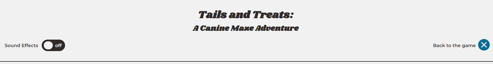

The header contains a heading, subheading and navigation. The navigation is hidden when the user first opens the website. Once the user starts the game, the header navigation shows a button to open the menu. When the menu is open, after a game has been started, the navigation shows a button to go back to the game. If no game has been started yet, the navigation is hidden.

The navigation also contains a toggle switch to turn the sound effects of the game on and off. The accessible toggle button was adapted from [ErikKroes.nl](https://www.erikkroes.nl/blog/accessible-html-toggle-button-switch/). By default, it is turned off and no sounds are playing.

### **Footer**

The footer includes a link to my personal GitHub and LinkedIn pages.
At the bottom of the footer, I have the copyright information.

### **Main Menu**

The menu is the default landing page for the game. From the menu, the user can either start a new game or read the rules. If a game has already been started, the navigation in the header allows the user to close the menu and resume playing. Under these two buttons, there is an animated image of dogs playing. The image fits well with the color scheme of the game and introduces the user to the theme of the game.

### **Rules modal**

I decided to use a modal to display the game rules. To ensure accessibility, I used the `aria-hidden` attribute to describe which sections of the page are visible depending on the state of the modal.

### **Start new game modal**

One of the goals of this game is to make it customizable. That is why the user has to select a dog character and game difficulty before starting to play. To keep the page style consistent, I decided to also use a modal for the **Start new game** button. In this modal, I added a form for the user to select a dog and difficulty. There is an option pre-checked for each to ensure there is a selection made.

The mazes for bigger-sized screens are horizontal. However, for the mobile version of this game, I added a vertical maze to make better use of the available screen size. When the screen size is smaller than 600px, only the mobile option is selectable.

### **Maze**

After looking at different ways of creating a maze in JavaScript, I decided to use the [Playable Maze Game Generator](https://www.the-art-of-web.com/javascript/playable-maze-generator/) as my main resource. I had a look at how to implement a randomly generated maze from many different resources. But this seemed like the best option to me and I liked being able to just use the necessary functions from the *MazeBuilder* class to build my maze and carry on doing the other things myself. So I used the [maze-builder.js](https://www.the-art-of-web.com/maze-builder.js) file and adapted it to the needs of my maze. There were many functions in the tutorial that I did not need so I deleted them.

In terms of styling, I decided to keep it simple with a white background and dark-brown walls as the colorful treats and the dog character make the maze busy enough. To indicate the exit of the maze, a bag of treats is placed above the opening.

If sound effects are turned on, there is an audio of a dog panting playing while the game is running. When the dog collects a treat, there is the sound of a dog eating a treat playing.

While navigating through the maze, the image of the dog character is flipped so the dog´s head faces the correct direction. Under the maze, the number of collected treats as well as a timer are displayed.

As described above, the mobile maze is vertical to make better use of the available screen.

### **Congratulations modal**

When the user reaches the exit of the maze, the game is stopped. A modal appears showing the number of treats the user collected and the time spent playing. Above the text, the selected dog character is shown with a dog bowl. The bowl is filled to different levels, depending on the number of treats the user collected. If the user collected no treats, the bowl is empty.

If sound effects are turned on, there is an audio of a dog eating playing.

If the user collected less than half of the available treats, the bowl is half full.

If the user collected more than half of the available treats, the bowl is full.

And if the user collected all of the available treats, the bowl is full and overflowing with food.

A score is calculated based on the number of treats, the time and the selected difficulty of the maze. The number of treats has the highest weight on the calculation. The highscore table is displayed at the bottom of the modal. The table holds up to 10 entries, always showing the 10 best attempts. The table row with the current attempt is highlighted. The highscore can be reset.

If the user decides to start a new game, the menu opens and the values for the number of collected treats and time are reset. Only the decision that was made for the sound effects stays the same as in the last game.

### **Custom 404 Page**

I added a custom 404 page to direct the user to a customized error page that is consistent with the website style. The button is linked to the main menu.

## **Future Enhancements**

I believe I added all the necessary features to create a project that is ready to be used as a real-life game. However, there is always room for improvement and further features. Here are some enhancements I would like to make in the future.

- The size of the maze could be adapted even better to the screen size of the user. Maybe I could find a way to calculate the size of the maze based on the used device.
- I would like to include a database to add a public highscore so the users can compete against other users too and not only try to beat their own highscore.
- Some of my functions can be refactored to reduce cognitive complexity.
- I would like to remove the external class and try to build the maze completely from scratch.

## **Testing**

### **Manual Testing**

I deployed the first version of my project after finishing the header and footer. This way I was able to use Lighthouse testing right away and make improvements for accessibility and performance early. I regularly tested my live website in **Google Chrome**, resizing the browser using *Dev Tools*. I also opened the website on my phone and tablet after pushing new features. I think you get a better feeling for the mobile version of a website when opening it on a real phone, instead of a smaller browser window. Furthermore, I have **Microsoft Edge** and **Firefox** installed and made sure to open my deployed website there frequently. \
I used the *#peer-code-review* channel on Code Institute´s Slack to get some feedback from other students and sent the link to my game to friends and family asking them to test it.

I tested to a minimum screen width of **300px** and a maximum screen width of **3440px** with my monitor.
To test **Safari** and **iOS** devices I used my free trial on [BrowserStack](https://www.browserstack.com/).

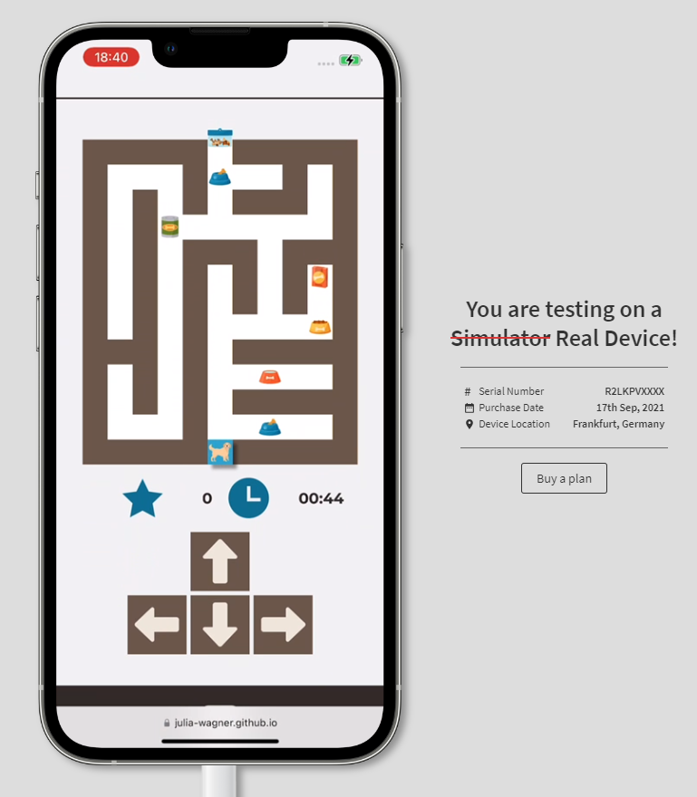
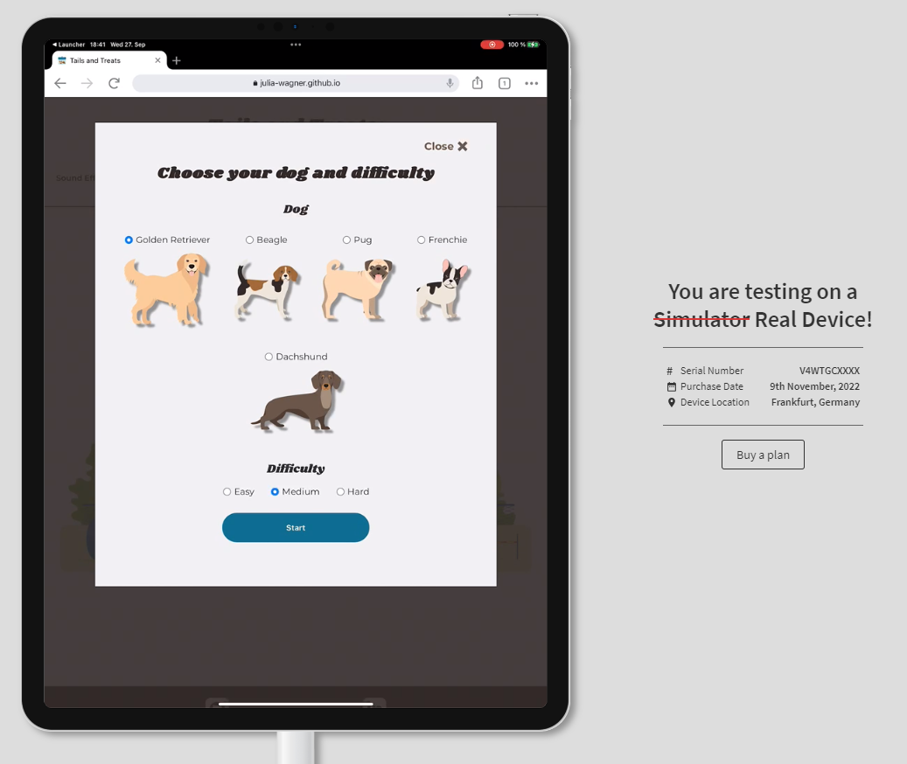

### **Issues**

During this project some issues kept me thinking for longer than others. Below is a list of issues that took me a while to fix and decisions that were a bit harder to make.

1. **Scattering the treats throughout the maze.**
    - After using and adapting the *MazeBuilder* class to create the maze, the next step was scattering the treats to collect throughout the maze.

    - My first attempt was using another class from my external reference. But with this class, there were treats on fields with walls, so they could not be collected. Another problem was, that the logic to use different images as treats was really complicated and this way not all of my treat images were being used.

    - **Fix** - I removed the second class and instead adapted the existing *MazeBuilder* class to add a treat to each row. Similar to how the exit and door of the maze are being added. I also adapted the styling and used different class names for each treat to make sure all of my images are being used at least once in each maze.

2. **Buttons with icons inside them.**
    - I used buttons with text and an icon to close my modals. While testing, I noticed that sometimes the button was not working and the modal was not closing.
    - Using DevTools I quickly noticed that the problem was that I have the icon wrapped inside a `` element within my button. So when the icon itself was clicked, the click event for the button was not triggered.
  
    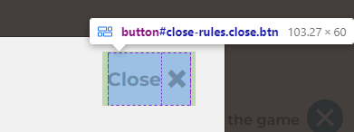

    - **Fix** - After doing some research, I found [this stackoverflow question](https://stackoverflow.com/questions/26402033/missing-click-event-for-span-inside-button-element-on-firefox) where the use of `pointer-events: none` was suggested. Adding that to my wrapped `<label>` elements fixed the issue.

3. **Scrolling with keyboard controls while playing.**
    - While using the keyboard controls for moving around the maze they were also being used for their default behavior, scrolling the page. This resulted in the page jumping when moving the dog up and down.
    - To prevent this, I used `e.preventDefault()` in my function handling the keyboard controls. This way, while playing the game, the page can not be scrolled with the keyboard controls, only with the mouse.
    - However, I got the feedback from one test person, that they would have expected the page to scroll when the maze is bigger than the vertical screen size.
    - **Decision** - I still decided to use `e.preventDefault()` as the jumping of the page really distracts from playing the game. After talking about this to other people testing my game, they agreed that the page jumping would be worse than having to use the mouse to scroll. In addition to this, the maze is not meant to be played on really narrow screen sizes. I extensively tested different standard screen sizes and they do not require scrolling the page to play the game.

### **Validation**

#### **HTML**

I used the [W3C Markup Validation Service](https://validator.w3.org/nu/?doc=https%3A%2F%2Fjulia-wagner.github.io%2Ftails-and-treats%2F) to validate my HTML and did not get any warnings or errors.

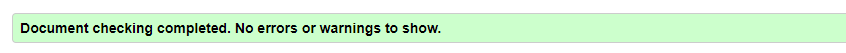

The full validation results can be found here:

- [index.html](docs/testing/html_validator_index.pdf)
- [404.html](docs/testing/html_validator_404.pdf)

#### **CSS**

I used the [Jigsaw CSS Validator](https://jigsaw.w3.org/css-validator/validator?uri=https%3A%2F%2Fjulia-wagner.github.io%2Ftails-and-treats%2F&profile=css3svg&usermedium=all&warning=1&vextwarning=&lang=en) to validate my CSS. The validation came back with no errors or warnings.

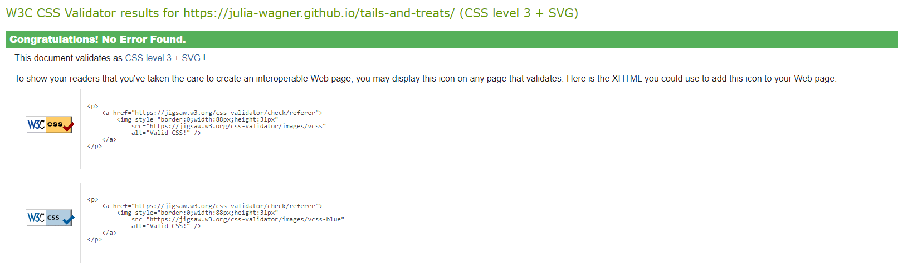

The full validation result can be found [here](docs/testing/css_validator_results.pdf).

#### **JavaScript**

I used [JSHint](https://jshint.com/) to check my JavaScript. At first, I got many warnings because I was using ES6 variables. This can be resolved by adding `/* jshint esversion: 6 */` as a comment in the first line of JSHint.

I got no warnings or errors for both my *script.js* and *maze-builder.js* files. Only the connection I have between those two files could not be seen by JSHint. This is why I got the information of an undefined variable for my *script.js* and an unused variable for my *maze-builder.js*. The MazeBuilder class is defined in *maze-builder.js* and used in *script.js*.

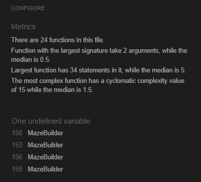
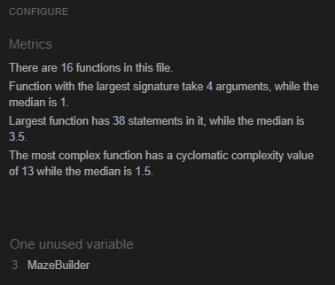

The full results can be found here:

- [script.js](docs/testing/js_validator_script.pdf)
- [maze-builder.js](docs/testing/js_validator_maze_builder.pdf)

### **Lighthouse Testing**

I got my score for *Accessibility*, *Best Practices* and *SEO* to 100 for all mobile and desktop pages. The score for *Performance* varies between 93 and 100 depending on the size and when I run the test.

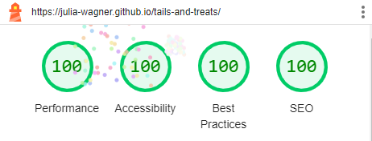
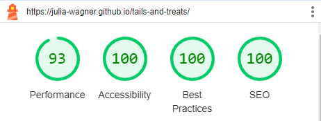

In order to explicitly test my maze, I used the *Snapshot* mode. This test passed all audits.

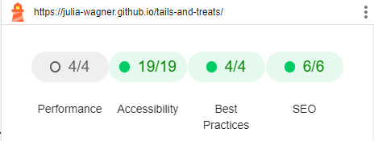

### **Accessibility Testing**

In addition to the Lighthouse Accessibility score, I tested my website using the [WAVE Tool](https://wave.webaim.org/) which returned no errors. It did return one alert regarding my sound toggle switch. In the WAVE reference it says, that labels are not appropriate for `<button>` elements, this is why the alert is showing. However, in the [Mozilla Developer reference](https://developer.mozilla.org/en-US/docs/Web/HTML/Element/label) for the `<label>` element, it says:

> Elements that can be associated with a `<label>` element include `<button>`, `<input>` (except for type="hidden"), `<meter>`, `<output>`, `<progress>`, `<select>` and `<textarea>`.

Because I have this reference assuring me that this is okay and because it is only an alert and no error, I decided to leave it like it is.

### **User Story Testing**

| User Story                                                                            | Expected Result                                                                                                                           | Pass    |
|---------------------------------------------------------------------------------------|-------------------------------------------------------------------------------------------------------------------------------------------|---------|
| As a user, I want to play a fun game.                                                 | The game is free and easy to use and the people testing it enjoy playing the game.                                                                     | &check; |
| As a user, I want to get better at the game and find the best way out of a maze.      | The game provides the users with feedback on how many points they got and how fast they found their way out.                              | &check; |
| As a user, I want to control a cute dog and navigate it through the maze.             | The character to move around the maze is a dog.                                                                                           | &check; |
| As a user, I want to collect dog treats scattered throughout the maze to get points.  | The items to collect in the maze are dog treats.                                                                                          | &check; |
| As a user, I want to customize my game experience.                                    | The game is customizable by letting the users select a dog character and difficulty level for the maze.                                   | &check; |
| As a user, I want to be able to see my progress throughout the game.                  | While playing the number of collected treats as well as a timer are shown.                                                                | &check; |
| As the site owner, I want to ensure the users have a good experience playing my game. | A good user experience is ensured by a well-planned design and layout as well as cute details like the dog characters and sound effects. | &check; |
| As the site owner, I want to provide the users with instructions and feedback.        | Clear instructions are easy to find and the users are provided with feedback and a highscore table after playing the game.                | &check; |

## **Deployment**

To be able to use Lighthouse testing right away, I deployed my website after implementing the header and footer. The steps to deploying a website on GitHub pages are:

1. Open the [repository](https://github.com/Julia-Wagner/tails-and-treats) and go to the **Settings** tab.
2. Navigate to the **Pages** tab in the left menu.
3. Choose **Deploy from a branch** and select the according branch, *main* in my case.
4. Click save. The link to the deployed website can then be found in the [repository](https://github.com/Julia-Wagner/tails-and-treats) on the right menu under **Environments**.

The link to my live site is: [Tails and Treats: A Canine Maze Adventure](https://julia-wagner.github.io/tails-and-treats/)

## **Credits**

### **Acknowledgements**

- Thank you to my Code Institute Mentor [David Bowers](https://github.com/dnlbowers) for giving me valuable feedback and tips during this project.
- Thank you to my Code Institute Facilitator [Kay Welfare](https://github.com/Kathrin-ddggxh) for testing the game and making new suggestions.
- Thanks to the (unknown to me) assessor of my first Code Institute project for suggesting to use [Conventional Commits](https://www.conventionalcommits.org/en/v1.0.0/). I started using them for this project as soon as I got my assessment result and really grew to like this style of commit messages.

### **Content**

- Following the [Mozilla Developer reference](https://developer.mozilla.org/en-US/docs/Web/JavaScript/Reference/Statements/const#examples) for const, I decided to use UPPER_SNAKE_CASE for my constants.
- I used [this article on accessible modals](http://web-accessibility.carnegiemuseums.org/code/dialogs/) as a reference for my modals.
- To ensure following best practice for my SVG icons and images I read [this article on accessible SVGs](https://www.smashingmagazine.com/2021/05/accessible-svg-patterns-comparison/).
- I adapted the code to create my maze from the [Playable Maze Game Generator](https://www.the-art-of-web.com/javascript/playable-maze-generator/).
- The accessible sound toggle button was adapted from [ErikKroes.nl](https://www.erikkroes.nl/blog/accessible-html-toggle-button-switch/).
- To test my website I signed up for a free trial on [BrowserStack](https://www.browserstack.com/).
- To test accessibility on my website I used to [WAVE Tool](https://wave.webaim.org/).

### **Media and Design**

- The playground image, dog characters and treats are from [Shutterstock](https://www.shutterstock.com/).
- The other icons were embedded from [iconmonstr](https://iconmonstr.com/).
- I used [Balsamiq](https://balsamiq.com/) to create Wireframes.
- With [coolors.co](https://coolors.co/) I created a color scheme and used [contrast-grid.eightshapes.com](https://contrast-grid.eightshapes.com/?version=1.1.0&background-colors=&foreground-colors=%2383a603%0D%0A%231b4001%0D%0A%23f0deb4%0D%0A%23f6f7eb%0D%0A%23001e1d&es-color-form__tile-size=regular&es-color-form__show-contrast=aaa&es-color-form__show-contrast=aa&es-color-form__show-contrast=aa18&es-color-form__show-contrast=dnp) to check the contrast and possible color combinations.
- The fonts are imported from [Google Fonts](https://fonts.google.com/).
- The screenshot at the top of this document was taken from [Am I Responsive?](https://ui.dev/amiresponsive?url=https://julia-wagner.github.io/tails-and-treats/).
  