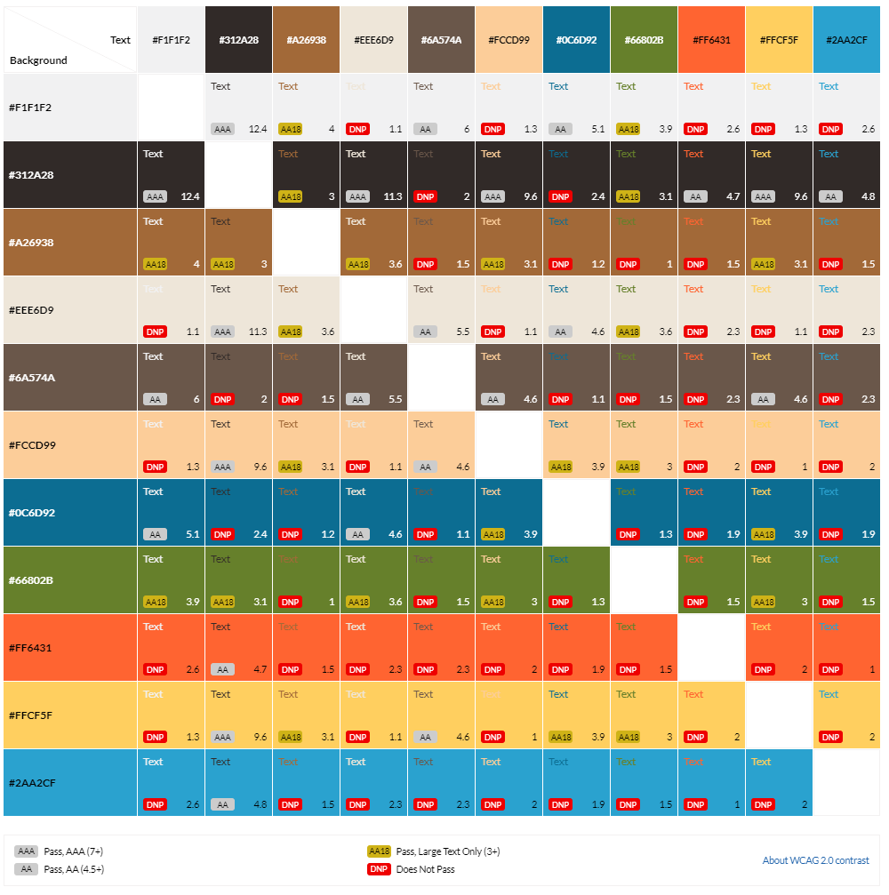

# **Tails and Treats: A Canine Maze Adventure**

Tails and Treats: A Canine Maze Adventure is a JavaScript based maze game.

## **Table of contents**

- [**Tails and Treats: A Canine Maze Adventure**](#tails-and-treats-a-canine-maze-adventure)
  - [**Table of contents**](#table-of-contents)
  - [**Planning**](#planning)
    - [**Target Audience**](#target-audience)
    - [**User Stories**](#user-stories)
    - [**Features to achieve the goals**](#features-to-achieve-the-goals)
    - [**Wireframes**](#wireframes)
    - [**Color Scheme**](#color-scheme)
    - [**Fonts**](#fonts)
    - [**Dog Characters and Treats**](#dog-characters-and-treats)
  - [**Features**](#features)
    - [**Header**](#header)
    - [**Footer**](#footer)

## **Planning**

### **Target Audience**

- People who want to pass the time with a fun game.
- People who want to challenge themselves finding the best way out of a maze.
- People who enjoy playing dog-themed games.

### **User Stories**

- As a user, I want to play a fun game.
- As a user, I want to get better at the game and find the best way out of a maze.
- As a user, I want to control a cute dog and navigate it through the maze.
- As a user, I want to collect dog treats scattered throughout the maze to get points.
- As a user, I want to customize my game experience.
- As a user, I want to be able to see my progress throughout the game.

- As the site owner, I want to ensure the users have a good experience playing my game.
- As the site owner, I want to provide the users with instructions and feedback.

### **Features to achieve the goals**

- The game will be free and easy to use with clear instructions to ensure a fun gaming experience.
- The game will provide the users with feedback on how many points they got and how fast they found their way out of the maze.
- To make the game dog-themed the character to control around the maze will be a dog. The items to collect within the maze will be dog treats.
- In order to make the game customizable the users will be able to select the difficulty of the maze and choose one of many dog characters.
- While playing the game, a timer will be shown as well as a counter for the collected points.

- The ensure a good user experience there will be clear instructions, a well-planned design and layout as well as clear feedback to the users.

### **Wireframes**

I created wireframes to visualize my ideas using [Balsamiq](https://balsamiq.com/). While creating the mobile wireframes, I realized I was not sure how to let the users control the character without a keyboard. At first I thought I would use touch controls. But after doing some research and playing other maze games on my phone, I realized that was not the best user experience. So I decided to add control buttons to play the game on a phone as shown in my mobile wireframe.

- [Mobile Menu](docs/wireframes/wireframe_mobile_menu.png)
- [Mobile Game](docs/wireframes/wireframe_mobile_game.png)
- [Desktop Menu](docs/wireframes/wireframe_desktop_menu.png)
- [Desktop Game](docs/wireframes/wireframe_desktop_game.png)

### **Color Scheme**

To create the color scheme I started by looking for icons I could use as dog characters and treats. I picked out the main colors used for these icons and used [contrast-grid.eightshapes.com](https://contrast-grid.eightshapes.com/?version=1.1.0&background-colors=&foreground-colors=%23F1F1F2%0D%0A%23312A28%0D%0A%23A26938%0D%0A%23EEE6D9%0D%0A%236A574A%0D%0A%23FCCD99%0D%0A%230c6d92%0D%0A%2366802B%0D%0A%23FF6431%0D%0A%0D%0A%23FFCF5F%0D%0A&es-color-form__tile-size=regular&es-color-form__show-contrast=aaa&es-color-form__show-contrast=aa&es-color-form__show-contrast=aa18&es-color-form__show-contrast=dnp) to check the contrast and possible color combinations.

### **Fonts**

I decided to use **Shrikhand** for my headings and **Montserrat** for my text. These two fonts seem to pair nicely and I like the bold and playful shape of Shrikhand for the topic of a dog-themed game.

### **Dog Characters and Treats**

I wanted to make the game customizable by letting the users decide which dog they want to navigate through the maze. For this I chose the following five dogs.

I also looked for icons I could use as treats to scatter throughout the maze.

## **Features**

### **Header**

The header contains a heading, subheading and navigation. The navigation is hidden when the user first opens the website. It contains two elements, but only shows one at a time, if any. Once the user starts game, the header navigation shows a button to open the menu. When the menu is open, after a game has been started, the navigation shows a button to go back to the game. If no game has been started yet, the navigation is hidden.

### **Footer**

The footer includes a link to my personal GitHub and LinkedIn pages.
At the bottom of the footer, I have the copyright information.

