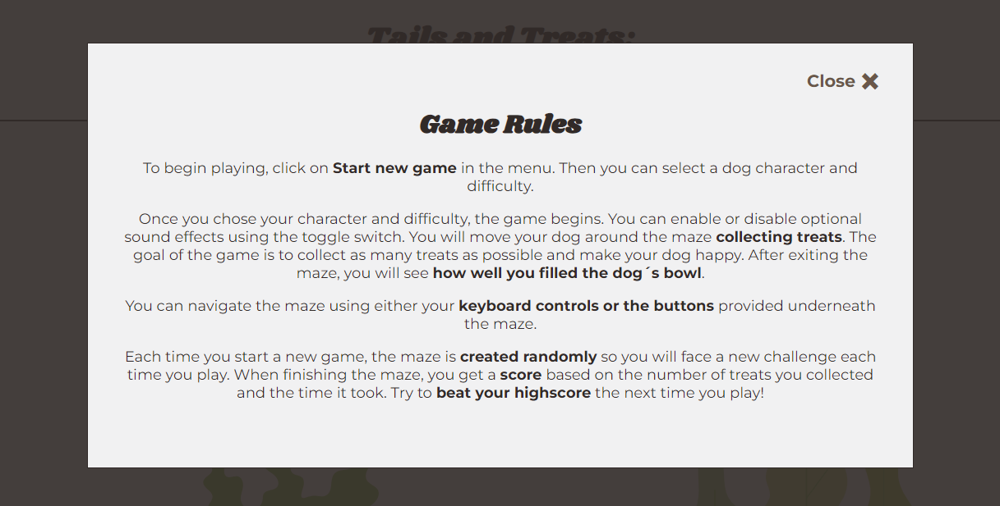
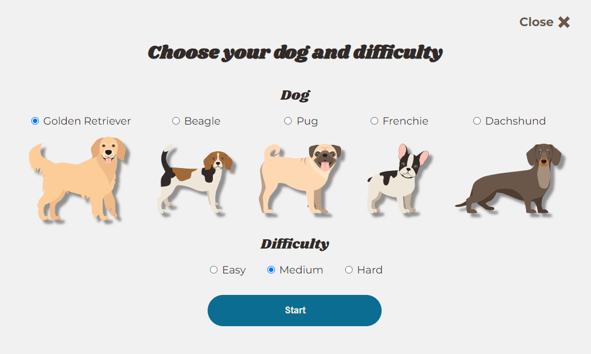
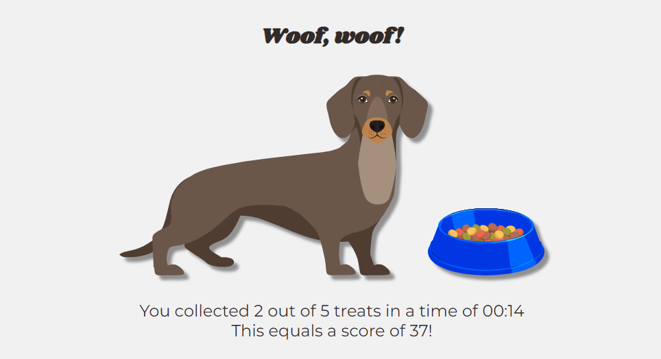
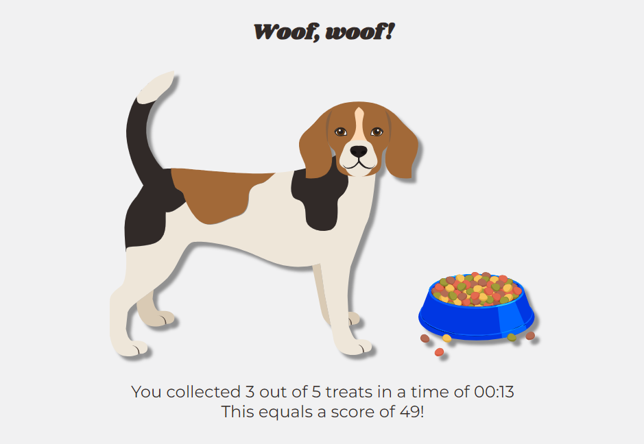
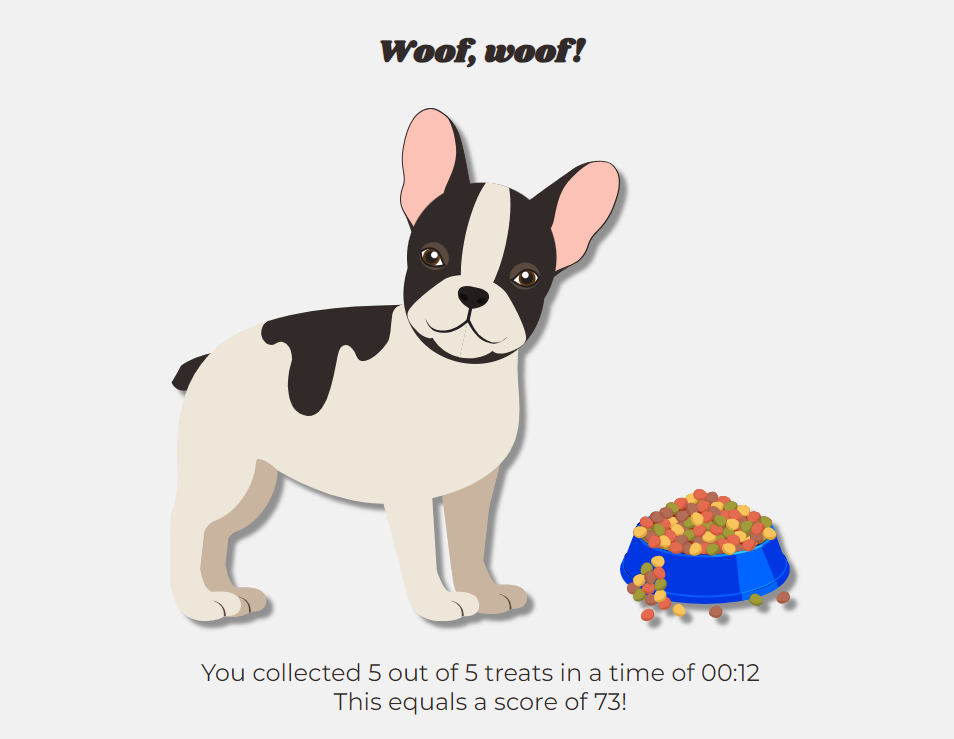

# **Tails and Treats: A Canine Maze Adventure**

[Link to live project](https://julia-wagner.github.io/tails-and-treats/)

*Tails and Treats: A Canine Maze Adventure* is a JavaScript-based maze game. Users can choose a dog character and navigate it through different mazes collecting treats for the dog. The game is fully functioning and ready to play. The rules are simple and the game is easy to play, even for children. The game is responsive and can be played on all devices.

## **Quick Start**

- Visit the [live project](https://julia-wagner.github.io/tails-and-treats/).
- Click "Start new game" in the menu.
- Choose a dog character and difficulty.
- Navigate the maze to collect treats and make your dog happy!

## **Table of contents**

- [**Tails and Treats: A Canine Maze Adventure**](#tails-and-treats-a-canine-maze-adventure)
  - [**Quick Start**](#quick-start)
  - [**Table of contents**](#table-of-contents)
  - [**Planning**](#planning)
    - [**Target Audience**](#target-audience)
    - [**User Stories**](#user-stories)
    - [**Features to achieve the goals**](#features-to-achieve-the-goals)
    - [**Wireframes**](#wireframes)
    - [**Color Scheme**](#color-scheme)
    - [**Fonts**](#fonts)
    - [**Dog Characters and Treats**](#dog-characters-and-treats)
  - [**Features**](#features)
    - [**Header**](#header)
    - [**Footer**](#footer)
    - [**Main Menu**](#main-menu)
    - [**Rules modal**](#rules-modal)
    - [**Start new game modal**](#start-new-game-modal)
    - [**Maze**](#maze)
    - [**Congratulations modal**](#congratulations-modal)
    - [**Custom 404 Page**](#custom-404-page)
  - [**Future Enhancements**](#future-enhancements)
  - [**Deployment**](#deployment)
  - [**Credits**](#credits)
    - [**Acknowledgments**](#acknowledgments)
    - [**Content**](#content)
    - [**Media and Design**](#media-and-design)

## **Planning**

### **Target Audience**

- People who want to pass the time with a fun game.
- People who want to challenge themselves to find the best way out of a maze.
- People who enjoy playing dog-themed games.

### **User Stories**

- As a user, I want to play a fun game.
- As a user, I want to get better at the game and find the best way out of a maze.
- As a user, I want to control a cute dog and navigate it through the maze.
- As a user, I want to collect dog treats scattered throughout the maze to get points.
- As a user, I want to customize my game experience.
- As a user, I want to be able to see my progress throughout the game.

- As the site owner, I want to ensure the users have a good experience playing my game.
- As the site owner, I want to provide the users with instructions and feedback.

### **Features to achieve the goals**

- The game will be free and easy to use with clear instructions to ensure a fun gaming experience.
- The game will provide the users with feedback on how many points they got and how fast they found their way out of the maze.
- To make the game dog-themed the character to control around the maze will be a dog. The items to collect within the maze will be dog treats.
- To make the game customizable the users will be able to select the difficulty of the maze and choose one of many dog characters.
- While playing the game, a timer will be shown as well as a counter for the collected points.

- The ensure a good user experience there will be clear instructions, a well-planned design and layout, as well as clear feedback to the users.

### **Wireframes**

I created wireframes to visualize my ideas using Balsamiq. While creating the mobile wireframes, I realized I was not sure how to let the users control the character without a keyboard. At first, I thought I would use touch controls. However, after doing some research and playing other maze games on my phone, I realized that was not the best user experience. So I decided to add control buttons to play the game on a phone as shown in my mobile wireframe.

- [Mobile Menu](docs/wireframes/wireframe_mobile_menu.png)
- [Mobile Game](docs/wireframes/wireframe_mobile_game.png)
- [Desktop Menu](docs/wireframes/wireframe_desktop_menu.png)
- [Desktop Game](docs/wireframes/wireframe_desktop_game.png)

### **Color Scheme**

To create the color scheme I started by looking for icons I could use as dog characters and treats. I picked out the main colors used for these icons and used [contrast-grid.eightshapes.com](https://contrast-grid.eightshapes.com/?version=1.1.0&background-colors=&foreground-colors=%23F1F1F2%0D%0A%23312A28%0D%0A%23A26938%0D%0A%23EEE6D9%0D%0A%236A574A%0D%0A%23FCCD99%0D%0A%230c6d92%0D%0A%2366802B%0D%0A%23FF6431%0D%0A%23FFCF5F%0D%0A%232aa2cf&es-color-form__tile-size=regular&es-color-form__show-contrast=aaa&es-color-form__show-contrast=aa&es-color-form__show-contrast=aa18&es-color-form__show-contrast=dnp) to check the contrast and possible color combinations.

For the main elements of the game I mainly used the brown tones, the earthy colors seem to fit the theme of the game and give a good contrast.

### **Fonts**

I decided to use **Shrikhand** for my headings and **Montserrat** for my text. These two fonts seem to pair nicely and I like the bold and playful shape of Shrikhand for the topic of a dog-themed game.

### **Dog Characters and Treats**

I wanted to make the game customizable by letting the users decide which dog they want to navigate through the maze. For this, I chose the following five dogs.

I also looked for icons I could use as treats to scatter throughout the maze.

## **Features**

### **Header**

The header contains a heading, subheading and navigation. The navigation is hidden when the user first opens the website. Once the user starts the game, the header navigation shows a button to open the menu. When the menu is open, after a game has been started, the navigation shows a button to go back to the game. If no game has been started yet, the navigation is hidden.

The navigation also contains a toggle switch to turn the sound effects of the game on and off. The accessible toggle button was adapted from [ErikKroes.nl](https://www.erikkroes.nl/blog/accessible-html-toggle-button-switch/). By default, it is turned off and no sounds are playing.

### **Footer**

The footer includes a link to my personal GitHub and LinkedIn pages.
At the bottom of the footer, I have the copyright information.

### **Main Menu**

The menu is the default landing page for the game. From the menu, the user can either start a new game or read the rules. If a game has already been started, the navigation in the header allows the user to close the menu and resume playing. Under these two buttons, there is an animated image of dogs playing. The image fits well with the color scheme of the game and introduces the user to the theme of the game.

### **Rules modal**

I decided to use a modal to display the game rules. To ensure accessibility, I used the `aria-hidden` attribute to describe which sections of the page are visible depending on the state of the modal.

### **Start new game modal**

One of the goals of this game is to make it customizable. That is why the user has to select a dog character and game difficulty before starting to play. To keep the page style consistent, I decided to also use a modal for the **Start new game** button. In this modal, I added a form for the user to select a dog and difficulty. There is an option pre-checked for each to ensure there is a selection made.

The mazes for bigger-sized screens are horizontal. However, for the mobile version of this game, I added a vertical maze to make better use of the available screen size. When the screen size is smaller than 600px, only the mobile option is selectable.

### **Maze**

After looking at different ways of creating a maze in JavaScript, I decided to use the [Playable Maze Game Generator](https://www.the-art-of-web.com/javascript/playable-maze-generator/) as my main resource. I had a look at how to implement a randomly generated maze from many different resources. But this seemed like the best option to me and I liked being able to just use the necessary functions from the *MazeBuilder* class to build my maze and carry on doing the other things myself. So I used the [maze-builder.js](https://www.the-art-of-web.com/maze-builder.js) file and adapted it to the needs of my maze. There were many functions in the tutorial that I did not need so I deleted them.

In terms of styling, I decided to keep it simple with a white background and dark-brown walls as the colorful treats and the dog character make the maze busy enough. To indicate the exit of the maze, a bag of treats is placed above the opening.

If sound effects are turned on, there is an audio of a dog panting playing while the game is running. When the dog collects a treat, there is the sound of a dog eating a treat playing.

While navigating through the maze, the image of the dog character is flipped so the dog´s head faces the correct direction. Under the maze, the number of collected treats as well as a timer are displayed. In the [Wireframes](#wireframes) section of this readme, I described that I would use control buttons for the mobile version of the game. However, I decided to display the arrow controls for all screen sizes. That is because there is no way for me to know whether the user has a keyboard or not, as a tablet might be the same size as a smaller laptop.

As described above, the mobile maze is vertical to make better use of the available screen.

### **Congratulations modal**

When the user reaches the exit of the maze, the game is stopped. A modal appears showing the number of treats the user collected and the time spent playing. Above the text, the selected dog character is shown with a dog bowl. The bowl is filled to different levels, depending on the number of treats the user collected. If the user collected no treats, the bowl is empty.

If sound effects are turned on, there is an audio of a dog eating playing.

If the user collected less than half of the available treats, the bowl is half full.

If the user collected more than half of the available treats, the bowl is full.

And if the user collected all of the available treats, the bowl is full and overflowing with food.

A score is calculated based on the number of treats, the time and the selected difficulty of the maze. The number of treats has the highest weight on the calculation. The highscore table is displayed at the bottom of the modal. The table holds up to 10 entries, always showing the 10 best attempts. The table row with the current attempt is highlighted. The highscore can be reset.

If the user decides to start a new game, the menu opens and the values for the number of collected treats and time are reset. Only the decision that was made for the sound effects stays the same as in the last game.

### **Custom 404 Page**

I added a custom 404 page to direct the user to a customized error page that is consistent with the website style. The button is linked to the main menu.

## **Future Enhancements**

I believe I added all the necessary features to create a project that is ready to be used as a real-life game. However, there is always room for improvement and further features. Here are some enhancements I would like to make in the future.

- The size of the maze could be adapted even better to the screen size of the user. Maybe I could find a way to calculate the size of the maze based on the used device.
- Some of my functions can be refactored to reduce cognitive complexity.
- I would like to remove the external class and try to build the maze completely from scratch.

## **Deployment**

To be able to use Lighthouse testing right away, I deployed my website after implementing the header and footer. The steps to deploying a website on GitHub pages are:

1. Open the [repository](https://github.com/Julia-Wagner/tails-and-treats) and go to the **Settings** tab.
2. Navigate to the **Pages** tab in the left menu.
3. Choose **Deploy from a branch** and select the according branch, *main* in my case.
4. Click save. The link to the deployed website can then be found in the [repository](https://github.com/Julia-Wagner/tails-and-treats) on the right menu under **Environments**.

The link to my live site is: [Tails and Treats: A Canine Maze Adventure](https://julia-wagner.github.io/tails-and-treats/)

## **Credits**

### **Acknowledgments**

Thanks to my Code Institute Mentor [David Bowers](https://github.com/dnlbowers) for giving me valuable feedback and tips during this project. And to my Code Institute Facilitator [Kay Welfare](https://github.com/Kathrin-ddggxh) for testing the game and making new suggestions.

### **Content**

- Following the [Mozilla Developer reference](https://developer.mozilla.org/en-US/docs/Web/JavaScript/Reference/Statements/const#examples) for const, I decided to use UPPER_SNAKE_CASE for my constants.
- I used [this article on accessible modals](http://web-accessibility.carnegiemuseums.org/code/dialogs/) as a reference for my modals.
- To ensure following best practice for my SVG icons and images I read [this article on accessible SVGs](https://www.smashingmagazine.com/2021/05/accessible-svg-patterns-comparison/).
- I adapted the code to create my maze from the [Playable Maze Game Generator](https://www.the-art-of-web.com/javascript/playable-maze-generator/).
- The accessible sound toggle button was adapted from [ErikKroes.nl](https://www.erikkroes.nl/blog/accessible-html-toggle-button-switch/).
- To test my website I signed up for a free trial on [BrowserStack](https://www.browserstack.com/).
- To test accessibility on my website I used to [WAVE Tool](https://wave.webaim.org/).

### **Media and Design**

- The playground image, dog characters and treats are from [Shutterstock](https://www.shutterstock.com/).
- The other icons were embedded from [iconmonstr](https://iconmonstr.com/).
- I used [Balsamiq](https://balsamiq.com/) to create Wireframes.
- With [coolors.co](https://coolors.co/) I created a color scheme and used [contrast-grid.eightshapes.com](https://contrast-grid.eightshapes.com/?version=1.1.0&background-colors=&foreground-colors=%2383a603%0D%0A%231b4001%0D%0A%23f0deb4%0D%0A%23f6f7eb%0D%0A%23001e1d&es-color-form__tile-size=regular&es-color-form__show-contrast=aaa&es-color-form__show-contrast=aa&es-color-form__show-contrast=aa18&es-color-form__show-contrast=dnp) to check the contrast and possible color combinations.
- The fonts are imported from [Google Fonts](https://fonts.google.com/).
- The screenshot at the top of this document was taken from [Am I Responsive?](https://ui.dev/amiresponsive?url=https://julia-wagner.github.io/tails-and-treats/).
  